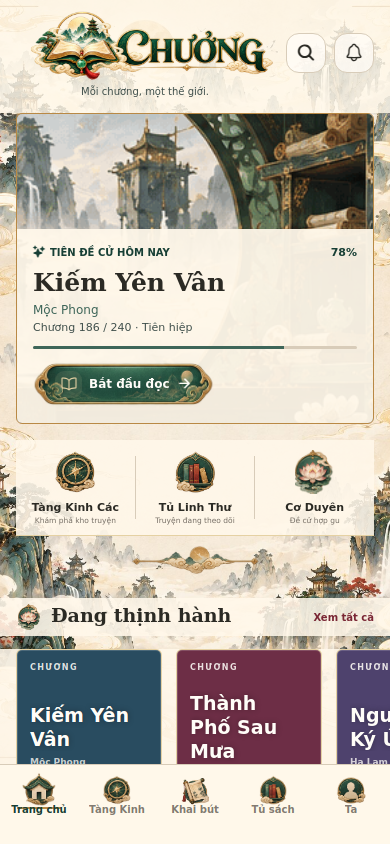
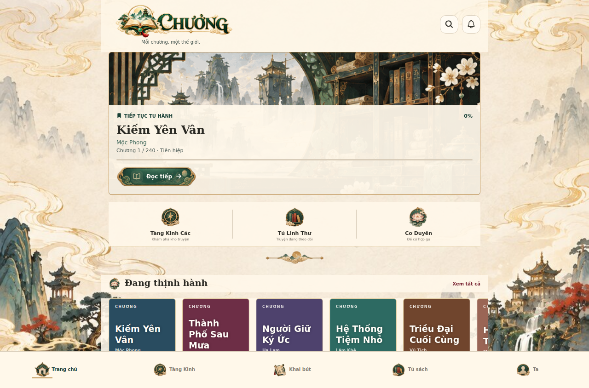
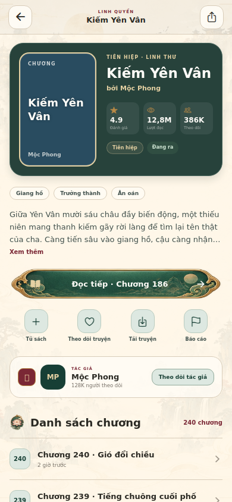
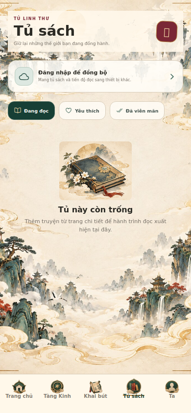
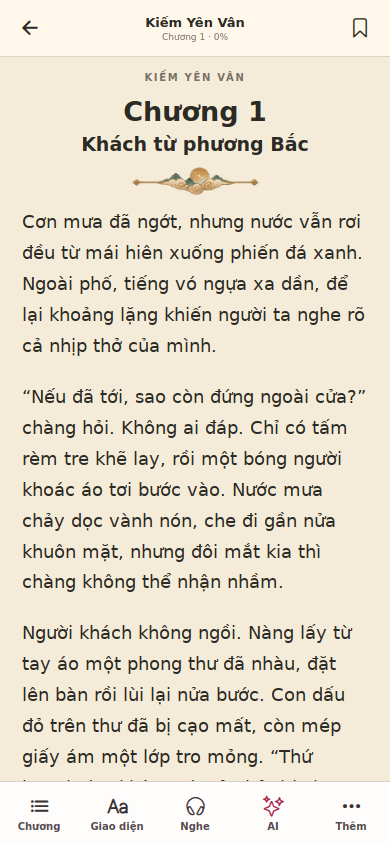

# CHUONG UI artwork correction

The artwork belongs to the application chrome, never to individual book covers.
Book covers continue to use the author/admin `coverUrl`; missing covers show a
plain title/color placeholder. The three previously assigned fantasy cover files
and all `XianxiaCoverArt` references have been removed.

## Application artwork

- Full-screen parchment landscape: `assets/xianxia/app-background.jpg`, generated
  from the supplied background sheet. Uses cover sizing, without distortion.
- Horizontal transparent logo: `assets/xianxia/logo-horizontal.png`, derived from
  the supplied logo/UI references.
- Navigation, quick actions, primary button frame, VIP badge and divider: cropped
  from the supplied `ui-kit-transparent.png`, retaining alpha transparency.
- Home banner retains its original colors. Text sits on a pale panel instead of
  a 72% dark overlay. Detail content has a light surface for reading contrast.
- Reader keeps its selectable plain reading backgrounds; the light theme has an
  ornamental chapter divider. Night and AMOLED behavior is unchanged.

No changes to backend configuration, uploads, authentication, payments or storage.

## Verification

- TypeScript: passed.
- Web export: passed.
- Release checks: 387 passed; existing store-release configuration items remain.
- Playwright demo suites: 4 passed, covering 20 routes, local library and reading
  progress persistence, reader settings, image loading and viewport overflow.
- Artwork screenshots checked at 390x844 and 1280x844 for Home, Detail, Library
  and Reader. Native Android/iOS builds were not tested.

For demo browser verification, export with `EXPO_PUBLIC_SUPABASE_MODE=demo` and
`--clear` to avoid an earlier production bundle remaining in Metro's cache.
This is a test-time environment setting, not a source-code configuration change.
`TEST_CHROMIUM_PATH` optionally selects an installed Chromium for Playwright.

## Captured UI

